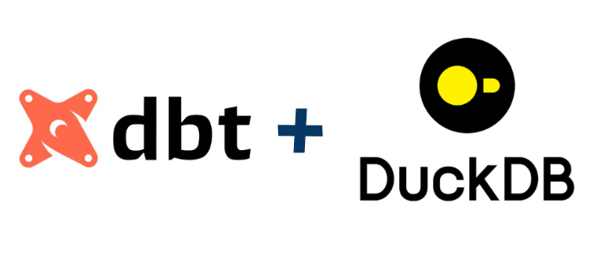
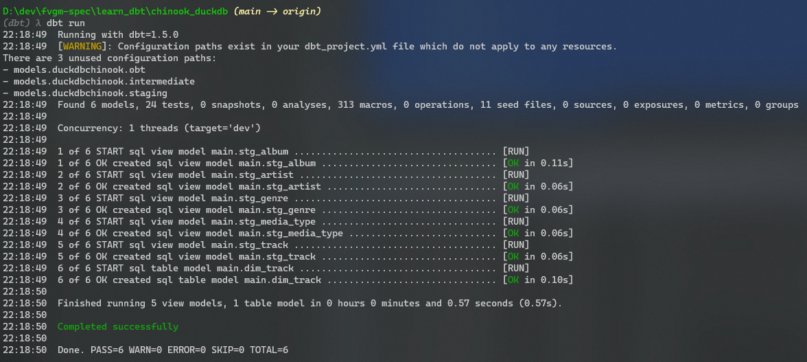
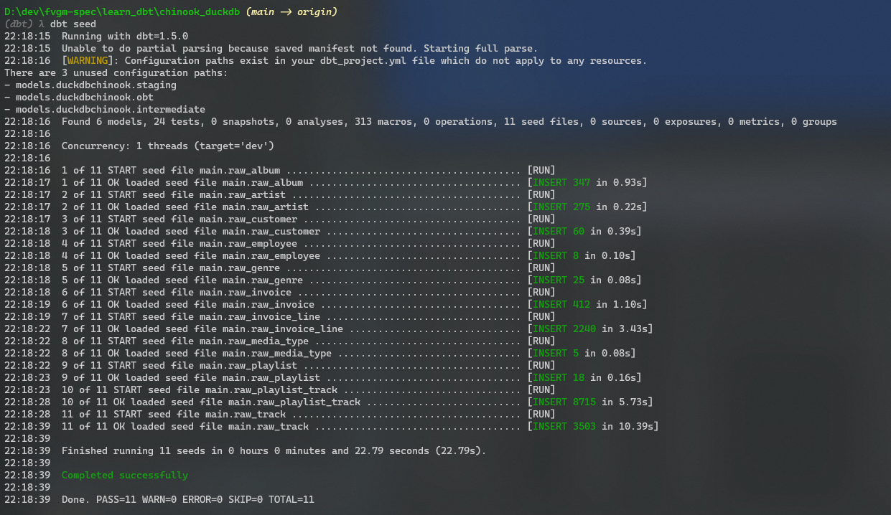
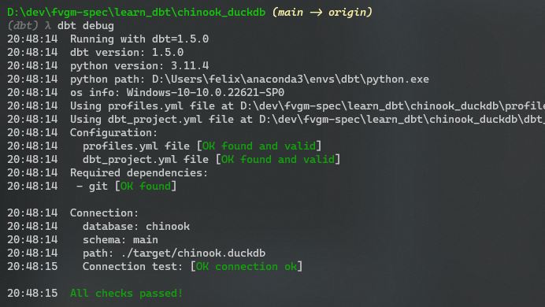

## Data Engineering: A Deep Dive into dbt with DuckDB

  

### Install & configure

1. Setting up virtual environment: The first step in the process is to create a conda environment with python 3.11 installed
    ```bash
    conda create -c conda-forge -n dbt python=3.11
    ```
    
    Then activate your conda environment by running:
    ```bash
    conda activate dbt
    ```

    Then you will need to clone the repository that contains this project:
    ```bash
    git clone https://github.com/fvgm-spec/learn_dbt.git
    ```

    ```bash
    cd learn_dbt/chinook_duckdb
    ```

    After that you will need to install the dependencies of the environment:
    ```bash
    pip install -r requirements.txt
    ```

2. Start generating data warehouse and models from scrtch: As stated in the [article writen](https://medium.com/@felixvidalgu/transforming-data-engineering-a-deep-dive-into-dbt-with-duckdb-ddd3a0c1e0c2) as a companion of this repo, you can start generating your database tables and models from scratch by deleting all the data from the project folder, you will need to execute the command `dbt clean`, this will remove the database file in target folder.

3. In order to generate the data warehouse and models you will need to run the following commands:
    ```bash
    dbt seed
    dbt run
    dbt debug
    ```






